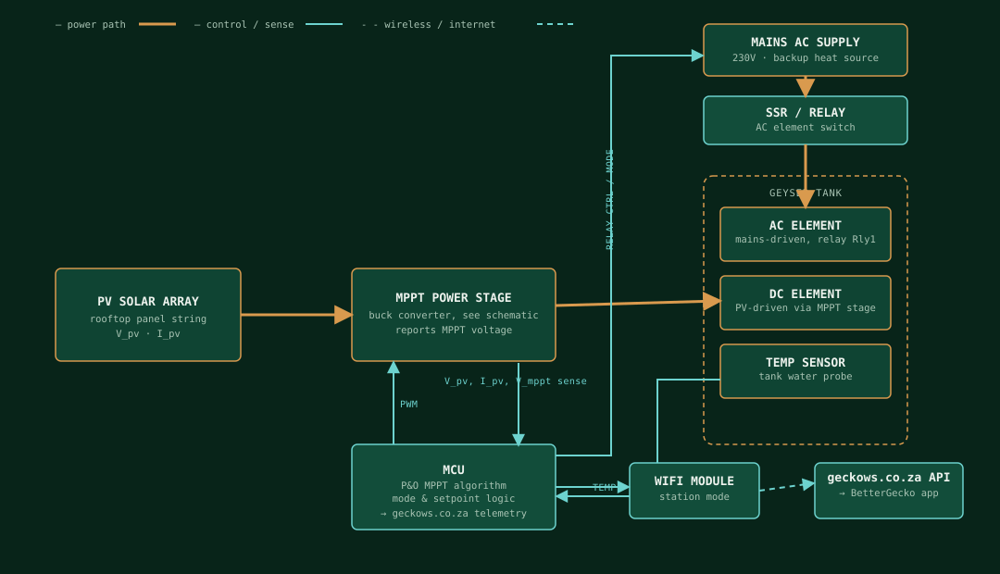

# GeyserGecko MPPT Controller — Circuit Diagram

> **Provenance.** BetterGecko is the iOS companion app for GeyserGecko — this repo
> contains no controller firmware or hardware schematic. The diagrams below are a
> **representative circuit**, reconstructed from the telemetry and controls the app
> actually reads and writes (`API/DeviceAPI.swift`, `Views/EnergyView.swift`): PV
> voltage, MPPT voltage, PV/AC active state, AC & PV setpoints, and operating mode.
> They describe the standard, correct-topology circuit that would produce exactly
> those signals — not a reverse-engineered copy of real hardware.

## System architecture

Two independent heat sources feed the same tank: the **DC element** is driven by
whatever the PV array can deliver once passed through the MPPT power stage; the
**AC element** is mains power gated by a relay under MCU control. `Operating Mode`
in the app (Off / Solar Only / Solar + Element / Element Only) enables or disables
these two paths independently in MCU logic.

## MPPT power stage — buck converter

A single-switch buck converter steers PV power into the DC element, with a
resistor-divider tap feeding back both PV voltage and output ("MPPT") voltage to
the MCU's ADC for the perturb-and-observe loop.

| Ref | Part | Function |
|---|---|---|
| F1 | Fuse | Input over-current protection on the PV line. |
| Rs1 | Shunt resistor | Develops a small voltage proportional to I_pv for the current-sense amp — needed to compute P_pv = V_pv × I_pv each MPPT step. |
| Cin | Input capacitor | Bulk storage; keeps PV-side voltage stable across the switching ripple of Q1. |
| R1 / R2 | Resistor divider | Scales PV voltage down to MCU ADC range — this is the "PV Voltage" the app graphs. |
| Q1 | N-channel MOSFET | High-side buck switch; duty cycle set by the MCU's PWM output via the gate driver. |
| D2 | Schottky diode | Freewheeling/catch diode — carries inductor current while Q1 is off. |
| L1 | Power inductor | Buck inductor; stores energy each switching cycle and smooths current to the element. |
| Cout | Output capacitor | Smooths the element/output voltage. |
| R3 / R4 | Resistor divider | Scales output voltage down for the ADC — this is the "MPPT Voltage" the app graphs. |

## Control loop (perturb & observe)

1. Sample V_pv and I_pv; compute P_pv = V_pv × I_pv.
2. Compare against the previous cycle's power.
3. If power rose, keep perturbing the PWM duty cycle in the same direction; if it fell, reverse direction.
4. Clamp duty cycle so V_mppt stays within the AC/PV setpoint band the app writes via `setTemperature`.
5. If Operating Mode excludes solar (Off / Element Only), hold Q1 off entirely; if it excludes the element, hold the AC relay open regardless of tank temperature.

## Legend

| Line style | Meaning |
|---|---|
| Solid copper (thick) | Power net |
| Solid teal | Control / sense net |
| Dashed teal | Wireless / internet |
| Grey | Ground return |

An interactive, themed version of these diagrams is also available as a
[published artifact](https://claude.ai/code/artifact/1096279c-9fa2-4b00-bb29-3f7aee9a36ea).
